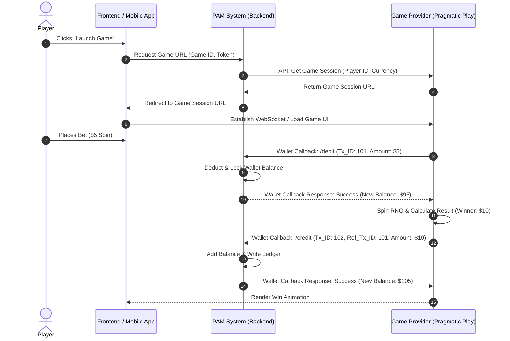

# iGaming Domain Context & Technical Reference

This document serves as the primary domain knowledge base and reference model for the iGaming (Online Gambling, Sportsbook, Casino, and Lottery) systems within the Scrum Assistant workspace. AI Agents should refer to this document using the **Keyword-Scoped Reading** strategy to align product discovery, backlog creation, and system designs with iGaming regulations, vendor specifications, and architectural constraints.

---

## 1. Regulatory Compliance & Regional Frameworks

iGaming operations are governed by strict jurisdictional licensing and regulatory compliance policies. System designs, workflows, and database schemas must adhere to the limitations enforced by these licensing bodies.

### 1.1 International Jurisdictions
*   **MGA (Malta Gaming Authority):** The gold standard for European operations. Key requirements include strict Player Account separation (player funds must be held in accounts separate from operational funds), detailed audit trail logs for all gameplay, and mandatory integration of Responsible Gaming metrics.
*   **UKGC (United Kingdom Gambling Commission):** Emphasizes customer protection, source of funds (SOF) checks, KYC, and highly granular Responsible Gaming controls. Auto-play features are restricted, and credit card payments for gambling are banned.
*   **PAGCOR (Philippine Offshore Gaming Corporation):** Governs offshore and domestic gaming operations in the APAC region. Focuses heavily on AML (Anti-Money Laundering) reporting, game certification, and strict IP geofencing to prevent access from restricted jurisdictions.

### 1.2 Vietnam Regulatory Context
*   **Decree No. 06/2017/ND-CP (and subsequent proposals/amendments):** The regulatory framework governing horse racing, greyhound racing, and international football betting. 
    *   **Age Limit:** Players must be at least 21 years old.
    *   **Betting Limits:** Caps transactions at a minimum of VND 10,000 and a maximum of VND 1,000,000 per day per product (subject to change under draft revisions).
    *   **Physical vs. Digital:** Traditionally restricted to physical betting points or SMS-based mechanisms, though modern proposals aim to accommodate digital/mobile delivery pilots.
*   **Decree No. 30/2021/ND-CP (State Lottery Business):** Regulates state-owned traditional, digitized, and computerized lotteries (e.g., Vietlott). Computerized lottery sales are tightly restricted to licensed terminal operations and official phone channels (SMS), with online-only web/app sales facing strict compliance gates.

---

## 2. Domain Terminology & Glossary

To ensure consistent requirements engineering, the following standard industry terms are defined:

*   **PAM (Player Account Management):** The core backend system that manages player profiles, wallets, authentication, regulatory compliance (KYC/AML), responsible gaming limits, and interfaces with third-party gaming providers.
*   **Single Wallet (Unified Wallet):** An architectural design where a player has one central account balance in the PAM that can be spent dynamically across all verticals (Sportsbook, Casino, Lottery) without manual balance transfers.
*   **Multi-Wallet:** A legacy pattern where funds must be manually moved between a "Sportsbook Wallet," "Casino Wallet," and "Lottery Wallet." This is generally deprecated due to poor UX and high drop-off rates.
*   **RNG (Random Number Generator):** The algorithm used by Casino and Lottery systems to ensure games of chance produce unpredictable and fair results. RNGs must be certified by independent testing laboratories (e.g., GLI - Gaming Laboratories International, iTech Labs).
*   **RTP (Return to Player):** The theoretical percentage of wagered money a game pays back to players over time (e.g., a slot game with a 96% RTP returns $96 for every $100 wagered). RTP configurations are subject to licensing limits and must be clearly displayed to players.
*   **KYC (Know Your Customer):** The process of verifying a player's identity (ID upload, face match, address verification) before allowing withdrawals or high-volume deposits.
*   **AML (Anti-Money Laundering):** Regulatory controls to prevent illicit fund transfers. Involves velocity checks, source of wealth (SOW) verification, and flag systems for suspicious transactions (e.g., depositing and immediately withdrawing without wagering).
*   **Geofencing:** IP-based and GPS-based location tracking to prevent players from accessing the platform from prohibited territories (e.g., restricting Vietnam users from accessing specific offshore sportsbook feeds).

---

## 3. Core Vendor Ecosystem & Integrations

Modern iGaming systems do not build all content from scratch. They integrate tier-one vendors into the PAM via secure APIs and callbacks.

### 3.1 Sportsbook (e.g., Kambi Integration)
*   **Kambi** is a premier B2B sportsbook provider. The PAM integrates Kambi's front-end client via widgets or headless APIs.
*   **Wallet Callback Loop:** When a player places a sports bet, Kambi sends a real-time `debit` request to the PAM API. When the bet is settled (win/lose/refund), Kambi triggers a `credit` or `settlement` callback.
*   **Latency Requirements:** Bookmakers require round-trip wallet callback operations to complete within extremely low latency budgets (often < 200ms) to prevent bet slip timeouts during live betting (in-play).

### 3.2 Casino & Slots (e.g., Pragmatic Play Integration)
*   **Pragmatic Play** is a major supplier of slot games, live casino, and bingo.
*   **Seamless Game Launch:** The PAM calls Pragmatic Play's launch game API to obtain a unique session URL for the player.
*   **API Wallet Calls:** During gameplay, Pragmatic Play's game servers send HTTP requests directly to the PAM's Wallet endpoints:
    *   `verifySession` / `authenticate`: Validate player token.
    *   `bet` / `debit`: Deduct funds for a spin/wager.
    *   `result` / `credit`: Credit winnings back to the PAM wallet.
    *   `rollback`: Cancel a transaction if a game round fails or disconnects.

### 3.3 Payment Gateways & Integrations
*   **Local Gateways (Vietnam-specific):** Integrations with MoMo, ZaloPay, ShopeePay, and local bank direct transfers (Vietcombank, Techcombank, etc.) using automated payment parsing APIs.
*   **Crypto Wallets:** Dynamic deposit address generation (BTC, USDT-TRC20, ETH) with webhook listeners on blockchain explorers for deposit confirmations.
*   **Deposit/Withdrawal Flows:** Requires separate approval workflows for withdrawals based on risk scoring (AML checks, rollover requirements).

---

## 4. Technical Architecture & System Patterns

iGaming backends must be designed as highly concurrent, transactional, and resilient distributed systems.

### 4.1 Ledger Atomicity & Concurrency Control
*   **Transactional Integrity:** Every wallet transaction (debit, credit, rollback) must be **atomic, consistent, isolated, and durable (ACID)**. Double-spending must be architecturally impossible.
*   **Database Isolation Levels:** Databases managing the player ledger (e.g., PostgreSQL) typically use `SERIALIZABLE` or `REPEATABLE READ` transaction isolation with pessimistic locking (`SELECT ... FOR UPDATE`) on the player's wallet balance record to prevent race conditions during rapid concurrent game actions.
*   **Idempotency:** All transaction callbacks from game providers (Kambi, Pragmatic Play) must include a unique `transaction_id`. The PAM ledger must enforce unique constraints on this ID to ensure that if a vendor retries a webhook due to a network timeout, the player is not debited or credited twice.

### 4.2 Game API Integration Loop (Sequence)

---

## 5. Responsible Gaming & Player Safety

Responsible Gaming (RG) is a legal requirement in licensed jurisdictions. The PAM must enforce these controls at the core business logic level before wagers are sent to providers.

*   **Self-Exclusion:** Players can temporarily or permanently ban themselves from the platform. When enabled, all login attempts must be blocked, and all active sessions must be terminated instantly.
*   **Player-Set Limits:** 
    *   **Deposit Limits:** Maximum cumulative deposits allowed over a daily, weekly, or monthly window.
    *   **Loss Limits:** Maximum net loss allowed over a specified time window.
    *   **Session Time Limits:** Automatically logs out or shows a reality check pop-up when the player reaches their self-defined limit (e.g., 60 minutes).
*   **Verification Gate:** During the `verifySession` or `/debit` callback, if a player's RG limit is breached, the PAM must immediately reject the transaction with a specific compliance error code (e.g., `LIMIT_REACHED`).
