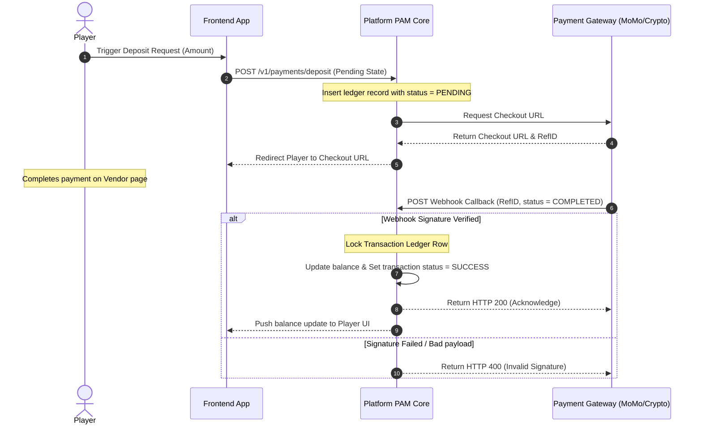

# 3rd Party Integration Matrix & Connection Flow Template

This document maps out the system boundaries, API protocols, latency SLAs, authentication standards, and ledger integration parameters between our platform core and external 3rd-party vendors (Sportsbook, Game Servers, Payments, KYC, Geofencing).

---

## 1. Integration Scope & Partner Matrix

This matrix maps out the primary technical endpoints and contracts for external service dependencies.

| Partner / Vendor | Service Module | Connection Protocol | Auth Method | Latency SLA (ms) | API Timeout (ms) | Retry / Failover Policy | PAM Ledger Mapping |
|:---|:---|:---|:---|:---:|:---:|:---|:---|
| **Kambi** | Sportsbook Engine | REST HTTPS / WebSockets | OAuth 2.0 Client Credentials | < 250ms | 500ms | 3x retry on 503, then void slip | `sportsbook_bets`, `sportsbook_payouts` |
| **Pragmatic Play** | Slot & Live Casino | REST API JSON | HMAC-SHA256 Payload Signature | < 150ms | 300ms | Strict idempotency key, rollback bet on timeout | `casino_wagers`, `casino_wins` |
| **MoMo Gateway** | Local Fiat Payment | REST HTTPS Webhook | RSA-2048 Private Keys / Webhook Secret | < 2,000ms | 5,000ms | Poll transaction status API every 15s | `fiat_deposits`, `payment_gateway_fees` |
| **Crypto Gateway** | Decentralized Wallet | gRPC / JSON-RPC | Secured Wallet Address + API Token | Asynchronous | N/A | Queue webhook callbacks in RabbitMQ | `crypto_deposits`, `gas_fees_ledger` |
| **GeoComply** | Geofencing Verification | SDK Webhook | Certified SSL Client Certificates | < 300ms | 1,000ms | Block transaction on timeout (Strict Gate) | `player_geogating_logs` |

---

## 2. API Contract & Parameter Mapping

### 2.1 Game Server Bet Deduct Loop (Standard JSON Contract)
Use when mapping input/output variables during Joint Application Design (JAD) workshops.

```json
{
  "request_header": {
    "partner_id": "pragmatic_01",
    "timestamp": "2026-05-28T04:12:00Z",
    "signature": "e3b0c44298fc1c149afbf4c8996fb92427ae41e4649b934ca495991b7852b855"
  },
  "transaction_payload": {
    "player_id": "ply_10029",
    "transaction_id": "tx_prag_889231",
    "game_code": "vs20olympus",
    "wager_amount": 2.50,
    "currency": "USD",
    "is_bonus_play": false
  }
}
```

### 2.2 Payment Gateway Deposit Webhook Contract
Use when mapping webhook payloads from MoMo or Crypto providers.

```json
{
  "webhook_header": {
    "provider": "momo_pay",
    "callback_url": "/v1/payments/momo/callback"
  },
  "payment_data": {
    "player_id": "ply_10029",
    "payment_reference": "momo_ref_9921827",
    "amount_received": 100000.00,
    "currency": "VND",
    "status": "COMPLETED",
    "fee_deducted": 1500.00
  }
}
```

---

## 3. Transaction State Transition Diagrams

### 3.1 Asynchronous Webhook Payment Flow (MoMo/Crypto)



---

## 4. Failover, Webhook Timeouts, & Reconciliation

### 4.1 Wallet API Timeout Failover Policy
1.  **Orphan Wager Policy:** If the Game Server sends a bet request, but the Platform PAM Core experiences a timeout (>300ms) or drops connection, the Game Server must block game play and send an automatic `POST /v1/wallet/rollback` request.
2.  **Reconciliation Cron:** A reconciliation script runs every 30 minutes, checking unmatched transactions between the provider's API logs and the platform wallet database, automatically creating reversing ledger adjustments for flagged orphans.

### 4.2 Webhook Signature & Security Standards
*   All webhooks must be verified using SHA-256 HMAC keys stored in secured environment variables.
*   Retries on webhook failures must implement **exponential backoff** (retry after 5s, 15s, 1m, 5m, 15m, 1h) before marking the webhook as failed and sending a slack alert to System Support.
