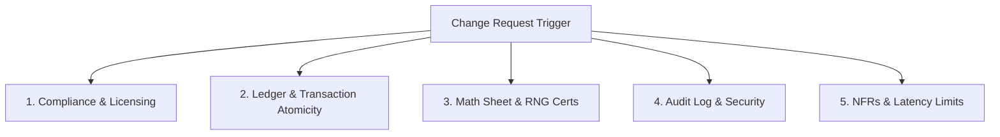

# Change Request Impact Analysis Framework

## Overview
This skill provides a structured framework for assessing the ripple effects of Change Requests (CRs) across iGaming architectures. It ensures that system changes are evaluated not only for codebase feasibility but also for regulatory compliance, math sheet integrity, database concurrency, and GLI certification impacts.

---

## When to Use
*   A regulator mandates a change in game taxation, self-exclusion rules, or geofencing strictness.
*   A third-party game server or payment provider updates their API contract.
*   The product team requests an adjustment to game mechanics, RTP, or the promotional bonus engine.
*   Assessing the tech debt or system latency added by adding new validations to core high-concurrency endpoints.

---

## The iGaming Five-Pillar Impact Checklist

Before approving any system change, a senior BA/SM must evaluate the impact across five critical areas:



### 1. Compliance & Licensing
*   Does this change violate local lottery or casino laws?
*   Does it require an external audit or re-submission to labs (GLI, iTech, etc.)?

### 2. Ledger & Transaction Atomicity
*   Does it touch the core player balance wallet?
*   Is there a risk of race conditions or double-spending?
*   Does it introduce database row-locks that could block concurrent actions?

### 3. Math Sheet & RNG Integrity
*   Does this change alter RTP, payout frequencies, or prize tiers?
*   Does it alter the random seeding generation process?

### 4. Audit Log & Security
*   Does this change alter how transactions are recorded in the general ledger database?
*   Are compliance logs (KYC verification, IP geolocation checks) correctly preserved?

### 5. NFRs & Latency Limits
*   Does this add latency to core endpoints (e.g., adding a third-party API check during a wager)?
*   Can the system scale to support target concurrent connections at peak times?

---

## Impact Assessment Template

```markdown
# Change Impact Assessment (CIA)

## 1. Change Description & Drivers
*   **Change Trigger:** [Regulatory update, product request, API deprecation]
*   **Target Scope:** [Core PAM, Game Server, Payment Gateway, Frontend App]

## 2. Regulatory & Compliance Scope
*   **License Jurisdictions Affected:** [e.g., MGA, UKGC, local lottery board]
*   **Testing Agency Re-certification Required:** [Yes / No]
*   **Compliance Lead Sign-Off Required:** [Yes / No]

## 3. Systems Architecture Impact
*   **Affected APIs:** [List endpoints, e.g., POST /v1/wallet/debit]
*   **Database Schema Updates:** [List table modifications, new tables, or indexing changes]
*   **Third-party Integrations:** [KYC vendors, payment gateways, RNG servers]

## 4. Risk Mitigation & Testing Strategy
*   **Primary System Risk:** [e.g., database deadlocks, balance discrepancies, latency lag]
*   **Testing Strategy:** [Unit testing, high-concurrency load tests, regression paths]
```

---

## Real-World iGaming Scenario Example

### Scenario: Local Lottery Tax Deduction at Source (10% on Wins > USD 1,000)

**Context:** A local regulator mandates that the lottery platform must instantly deduct a 10% tax at source from any player win exceeding USD 1,000 and route the tax ledger entry to a regulatory pool.

#### Systems Impact Analysis

| System Pillar | Impact Analysis | Mitigation / BA Requirement |
|:---|:---|:---|
| **1. Compliance** | Mandatory regulation. Failure = suspension of local lottery license. No external lab re-certification needed since math RTP remains intact, but audit reports require updating. | Create a dedicated compliance report format demonstrating daily tax collections. |
| **2. Ledger Atomicity** | High risk. A win payout (e.g., USD 2,000) must be credited as USD 1,800 to the player and USD 200 debited/routed to the tax ledger ledger account. This must be an *atomic transaction*. | The API `POST /v1/wallet/credit` must wrap the win-credit and tax-deduction in a single SQL transaction block. |
| **3. Math Sheet** | No impact on the game's intrinsic RTP, since the math model still awards the full USD 2,000 prize. The tax occurs as a post-payout platform event. | Explicitly separate math sheet specifications from PAM platform ledger rules in Confluence. |
| **4. Audit Logs** | Every ledger transaction must document: gross win amount, tax deducted, net win credited, and transaction references. | Modify database schema in `ledger_transactions` to include: `gross_amount`, `tax_deducted`, and `net_amount` columns. |
| **5. NFRs (Latency)** | Computing the tax check adds slight latency to the payout loop (evaluation takes < 5ms). | Keep tax rules localized inside the platform memory cache rather than making queries to third-party databases. |

---

## Common Pitfalls & SM Delivery Mitigations

### ❌ Underestimating Testing Complexity
*   *Symptom:* Approving a change request as a "small database index change" without mapping the regression path.
*   *Consequence:* Blocked queues or balance mismatch errors during live peak concurrent wagers.
*   *SM Mitigation:* Ensure that all database and PAM core changes undergo high-volume concurrency testing in staging environments before release.
