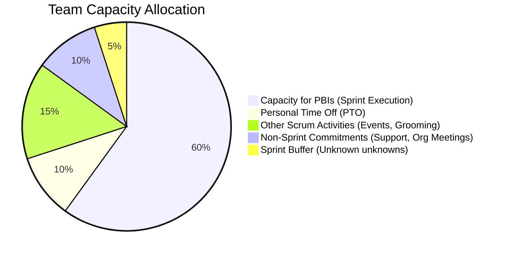

### 🤖 AGENT DIRECTIVE (HIDDEN FROM FINAL OUTPUT)
1.  **Reference First:** Load and apply [references/one-part-planning-guide.md](references/one-part-planning-guide.md) before populating this template.
2.  **Format:** Output a slide-by-slide presentation deck using markdown page breaks (`---` and `## SLIDE X:`).
3.  **Real-Time Facilitation Prompts:** Include a dedicated "🎤 *SM Facilitation Prompt*" for each slide to assist the Scrum Master in running the event.
4.  **Capacity Visuals (Figure 19.5 & Table 19.2 Aggregate):** 
    - Include the Mermaid Pie Chart (Figure 19.5) on the Capacity slide.
    - Provide a team-wide aggregate version of Table 19.2 (no individual names to prevent micromanagement, but clear mathematical breakdown of the team's total capacity).
5.  **Socratic Closing Prompt:** Append the closing Socratic facilitation question at the very end.
6.  **Output Generation:** Output ONLY the section below this line.

---

# 🖥️ SPRINT PLANNING FACILITATION DECK (SM TOOL)

## SLIDE 1: Sprint Planning Kickoff
*   **Sprint Reference:** *[Agent: Sprint Name or Number]*
*   **Timebox Limit:** *[Agent: e.g., 4 Hours]*
*   **Attendees:** Product Owner, Scrum Master, Developers
*   **Agenda:**
    1.  **WHY:** Craft the Sprint Goal
    2.  **WHAT:** Forecast Product Backlog Items (PBIs)
    3.  **HOW:** Define Tasks, Estimate Effort & Confirm Commitment

🎤 *SM Facilitation Prompt: "Welcome team to the Sprint Planning for [Sprint Name]. Today we align on a shared direction and commit to what we can realistically achieve. Let's start with the business value."*

---

## SLIDE 2: Topic 1: WHY is this Sprint valuable?
*   **Business Opportunity / Context:**
    *   *[Agent: Insert 1-2 sentences summarizing the PO's current market driver or user problem]*
*   **Drafting the Sprint Goal:**
    *   **Sprint Goal:** *[Agent: Insert Proposed Sprint Goal]*
*   **Expected Business Value:**
    *   *[Agent: Describe the measurable/verifiable benefit of achieving this goal]*

🎤 *SM Facilitation Prompt: "Product Owner, please walk us through the vision. Developers, does this goal provide a clear focus? Let's refine it together until we have a single, cohesive Sprint Goal."*

---

## SLIDE 3: Team Capacity Overview (Figure 19.5)
*To plan realistically and maintain a sustainable pace, we allocate our total Sprint hours across five key categories:*

🎤 *SM Facilitation Prompt: "This chart represents how we divide our total Sprint timebox. We protect 10% as buffer and allocate 15% to Scrum events. This keeps our plan realistic and prevents the team from running at 100% capacity."*

---

## SLIDE 4: Capacity Calculation (Table 19.2 Aggregate)
*Team-wide aggregate math to determine total effort-hours available for PBI task work:*

| Capacity Metric | Team Total (Aggregate) |
| :--- | :---: |
| **Gross Developer Days Available** *(e.g., [N] Devs x 10 days)* | *[Agent: Total Days]* |
| ➖ Planned PTO & Holidays (Days) | *[Agent: Total PTO Days]* |
| ➖ Scrum Events & Refinement overhead (Days) | *[Agent: Total Event Days]* |
| **Net Working Days Available** | **[Agent: Net Days]** |
| ✖️ Net Effort-Hours per Day *(typically 6 hrs/day)* | *[Agent: Net Hours/Day]* |
| **🎯 NET AVAILABLE EFFORT-HOURS (Team Total)** | **[Agent: Total Effort-Hours]** |

🎤 *SM Facilitation Prompt: "We have a total of [Total Effort-Hours] net effort-hours available for Sprint execution tasks. Let's use this number as our ceiling for the One-Part Planning loop."*

---

## SLIDE 5: Topic 2: WHAT can be done this Sprint?
*Evaluating the highest priority Product Backlog Items (PBIs) matching our Sprint Goal:*

*   **PBI 1:** *[Agent: User Story Story-1]* (*[Size]* pts) - Meets DoR: **Yes**
*   **PBI 2:** *[Agent: User Story Story-2]* (*[Size]* pts) - Meets DoR: **Yes**
*   **PBI 3:** *[Agent: User Story Story-3]* (*[Size]* pts) - Meets DoR: **Yes**

*Current Backlog Forecast Status:*
*   **Sprint Goal Alignment:** *[Agent: Describe how these items support the Goal]*
*   **Current Confidence Level:** *[Agent: e.g., High / Medium]*

🎤 *SM Facilitation Prompt: "Are the top stories on this slide clear? Have we verified that they meet our Definition of Ready? Let's take the first item and move directly to breaking it down."*

---

## SLIDE 6: Topic 3: HOW will the work get done?
*Executing the One-Part Planning Loop: Select -> Task Out -> Deduct Hours -> Repeat.*

*   **PBI #1: [PBI Name]**
    *   Task Breakdown: Tasks planned and estimated at **[X]** total hours.
*   **PBI #2: [PBI Name]**
    *   Task Breakdown: Tasks planned and estimated at **[Y]** total hours.
*   **PBI #3: [PBI Name]**
    *   Task Breakdown: Tasks planned and estimated at **[Z]** total hours.

**Calculated Totals for this Sprint:**
*   **Total Task Hours Planned:** *[Sum of X+Y+Z]* hours
*   **Remaining Team Capacity:** *[Net Available Effort-Hours - Planned Hours]* hours

🎤 *SM Facilitation Prompt: "Developers, as you design the technical tasks, ensure no task is larger than 8 hours. If we run out of capacity, we must stop and discuss with the Product Owner what we can remove."*

---

## SLIDE 7: Commitment & Definition of Done (DoD)
*Confirming the plan and aligning on quality standards:*

*   **Definition of Done (DoD) Agreement:**
    *   All developers agree that the task plan covers all verification checks to build a "Done", shippable increment.
*   **Quality Gates Checklist:**
    *   - [ ] Automated tests written and executed
    *   - [ ] Code review completed by another developer
    *   - [ ] *[Agent: Insert iGaming/project regulatory checklist item]*
*   **Team Commitment Statement:**
    *   "The Developers forecast that we can deliver the selected items and achieve the Sprint Goal within our available capacity."

🎤 *SM Facilitation Prompt: "Developers, do you feel this plan is realistic and that you have the capability to deliver these items by the end of the Sprint? If yes, let's finalize our commitment."*

---

## SLIDE 8: Sprint Review Invitation
*Sharing our commitment and inviting collaboration at the end of the Sprint:*

*   **What will be inspected:**
    *   A live demonstration of the Sprint increment, proving the Sprint Goal is achieved.
*   **Sprint Review Details:**
    *   **Date/Time:** *[Agent: Date & Time]*
    *   **Location/Link:** *[Agent: Meeting link]*
    *   **Audience:** Scrum Team + Key Stakeholders

🎤 *SM Facilitation Prompt: "Great work completing the Sprint Planning. I will distribute this facilitation output and send out the invitation for the Sprint Review. Let's make this a successful Sprint!"*

---

*> **Socratic Closing Prompt (Agent Appends This):** "Chủ nhân, the Facilitation Deck is ready. Does it provide the appropriate visual support for your live sessions? Would you like to adjust the facilitation prompts or the categories in Figure 19.5?"*
