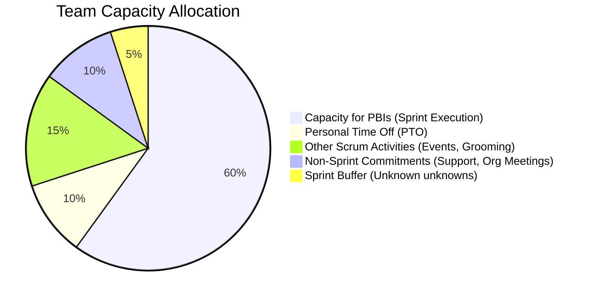

### 🤖 AGENT DIRECTIVE (HIDDEN FROM FINAL OUTPUT)
1.  **Reference First:** Load and apply [references/one-part-planning-guide.md](references/one-part-planning-guide.md) before populating this template.
2.  **Format:** Output a slide-by-slide outline (`---` page breaks and `## SLIDE X:` headers). This file must remain PPTX-friendly (simple layouts: slide title, brief bullet points, and high-level tables or diagrams).
3.  **On-Demand Conversion:** Add a note indicating that the Agent stands ready to generate a formal presentation format if requested by the user.
4.  **No Micromanagement:** Absolutely DO NOT expose individual developer names or task-level details. Capacity must be presented in aggregate team-wide terms, and the backlog should list high-level PBIs only.
5.  **Capacity Visuals (Figure 19.5):** Show the team-wide capacity allocation Mermaid Pie Chart (Figure 19.5).
6.  **Socratic Closing Prompt:** Append the closing Socratic facilitation question at the very end.
7.  **Output Generation:** Output ONLY the section below this line.

---

# 🖥️ SPRINT PLANNING: STAKEHOLDER SUMMARY

## SLIDE 1: Sprint Overview
*   **Sprint Identifer:** *[Agent: Sprint Name or Number]*
*   **Sprint Duration:** *[Agent: e.g., June 5 - June 19, 2026]*
*   **Key Delivery Focus:** Business alignment, stakeholder transparency, and high-level milestones.
*   **Scrum Team:** *[Agent: Team Name, e.g., Core Wallet Team]*

---

## SLIDE 2: Sprint Goal & Business Value
*   **WHY is this Sprint valuable?**
*   **Sprint Goal:**
    *   *[Agent: Insert the overarching Sprint Goal]*
*   **Expected Business Impact:**
    *   *[Agent: Briefly state the expected outcome for the stakeholders/users upon reaching this goal]*
*   **Key Business Metrics Targeted:**
    *   *[Agent: e.g., 20% conversion increase, compliant audit log]*

---

## SLIDE 3: Sustainable Capacity Plan (Figure 19.5)
*We plan using empirical capacity, reserving time for events, buffers, and organizational overhead to ensure a predictable and high-quality release:*

---

## SLIDE 4: Capacity & Commitment Summary
*Summary of total effort-hours dedicated to executing the Sprint Goal:*

*   **Gross Working Hours Available:** *[Agent: Gross Hours, e.g., 400]* hours
*   **Scrum Events & Operational Overhead:** *[Agent: Event/PTO Hours, e.g., 100]* hours
*   **Sprint Buffer (Risk Management):** *[Agent: Buffer Hours, e.g., 40]* hours
*   **🎯 Net Available Effort-Hours:** **[Agent: Net Hours]** hours
*   **PBI Forecast Commitment:**
    *   *The Developers have committed to achieving the Sprint Goal by delivering the selected backlog items, which have been fully task-planned internally to verify feasibility.*

---

## SLIDE 5: Forecasted Deliverables (WHAT)
*High-level backlog items selected to achieve the Sprint Goal:*

*   **Deliverable 1:** *[Agent: High-Level Feature 1]*
    *   *Impact:* *[Agent: Short benefit description]*
*   **Deliverable 2:** *[Agent: High-Level Feature 2]*
    *   *Impact:* *[Agent: Short benefit description]*
*   **Deliverable 3:** *[Agent: High-Level Feature 3]*
    *   *Impact:* *[Agent: Short benefit description]*

---

## SLIDE 6: Quality Gates & Alignment
*Ensuring all deliverables meet our rigorous organizational and regulatory standards before release:*

*   **Definition of Done (DoD) Standard:**
    *   All features will be verified against the team's definition of done (including automated testing, code review, and compliance verification).
*   **iGaming / Regulatory Compliance:**
    *   - [x] Mathematics and payout ratios verified
    *   - [x] Security and access control validation
*   **Sprint Review Demonstration:**
    *   **Date/Time:** *[Agent: Date & Time]*
    *   *We welcome our stakeholders to join us to inspect the working software and adapt the roadmap together.*

---

*> **Socratic Closing Prompt (Agent Appends This):** "Chủ nhân, this is the Stakeholder Summary. It is structured to be clean and pptx-friendly. If you would like me to convert this into a presentation or slide deck format, please let me know. Do these slides meet your expectations for reporting to stakeholders?"*
