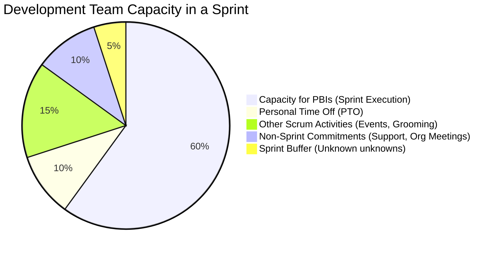

### 🤖 AGENT DIRECTIVE (HIDDEN FROM FINAL OUTPUT)
1.  **Reference First:** Load and apply [references/one-part-planning-guide.md](references/one-part-planning-guide.md) before populating this template.
2.  **Calculate Capacity:** Compute "Available Effort-Hours" by taking: `Net Available Effort-Hours = (Days Available - PTO Days - Scrum Event Days) * Net Hours/Day`.
3.  **Mermaid Generation (Figure 19.5):** Generate the Mermaid Pie Chart to visually reflect the percentage of time dedicated to PBIs vs. Overhead/Buffers based on Essential Scrum Figure 19.5.
4.  **One-Part Logic:** Ensure the Tasks (HOW) directly map to the PBIs (WHAT), proving the team has acquired confidence that the work fits within the Available Effort-Hours.
5.  **Socratic Closing Prompt:** Append the closing Socratic facilitation question at the very end.
6.  **Output Generation:** Output ONLY the section below this line.

---

# 🏃 SPRINT PLANNING BOARD: *[Agent: Insert Sprint Name/Number]*

## 1. 🎯 TOPIC ONE: WHY IS THIS SPRINT VALUABLE?
**SPRINT GOAL:** 
> *[Agent: Insert the single, cohesive Sprint Goal that provides focus and encourages the Scrum Team to work together.]*

## 2. 📊 TEAM CAPACITY & FORECASTING (Figure 19.5 & Table 19.2)

### A. Development Team Capacity Overview (Figure 19.5)
*This chart illustrates how the total Sprint timebox is allocated, protecting the team from 100% utilization traps and acknowledging necessary overhead.*

### B. Determining Effort-Hour Capacity (Table 19.2)
*Calculated based on actual availability to perform task-level work during this Sprint.*

| Person | Days Available (Less PTO/Holidays) | Hours/Day | Focus Factor | Focus Hours | Ceremony Hours | Net Available Effort-Hours |
| :--- | :---: | :---: | :---: | :---: | :---: | :---: |
| *[Agent: Name 1]* | *[Days]* | *[e.g., 8]* | *[e.g., 70%]* | *[Days * Hours * FF]* | *[Hours]* | **[Calculation: Focus Hours - Ceremony Hours]** |
| *[Agent: Name 2]* | *[Days]* | *[e.g., 8]* | *[e.g., 70%]* | *[Days * Hours * FF]* | *[Hours]* | **[Calculation: Focus Hours - Ceremony Hours]** |
| *[Agent: Name 3]* | *[Days]* | *[e.g., 8]* | *[e.g., 70%]* | *[Days * Hours * FF]* | *[Hours]* | **[Calculation: Focus Hours - Ceremony Hours]** |
| **TOTAL** | | | | | | **[Total Net Hours]** |

### C. Story Point Commitment Range
*Forecasting commitment using the team's historical velocity (points per dev-day calculated over the last 3+ Sprints).*

*   **Average Velocity (last 3 Sprints):** *[Agent: Avg Points]* points
*   **Average Capacity (last 3 Sprints):** *[Agent: Avg Dev-Days]* dev-days
*   **Team Productivity Rate:** *[Agent: Points/Dev-Day]* points per dev-day
*   **Recommended Commitment Range (0.85x to 1.00x):** **[Agent: Range Floor] to [Agent: Range Ceiling]** points
*   *Note: If historical velocity is not available or is unstable (< 3 Sprints), point-based forecasting is disabled. Plan using developer-days and Net Available Effort-Hours.*

## 3. 📦 TOPIC TWO: WHAT CAN BE DONE THIS SPRINT?
*Based on the Sprint Goal and the total Available Effort-Hours, the Developers forecast the following Product Backlog Items (PBIs).*

| PBI ID | PBI Name (User Story) | Est. Size (Points) | Meets DoR? |
| :---: | :--- | :---: | :---: |
| #001 | *[Agent: Insert PBI]* | *[Points]* | Yes |
| #002 | *[Agent: Insert PBI]* | *[Points]* | Yes |

## 4. 🛠️ TOPIC THREE: HOW WILL THE CHOSEN WORK GET DONE?
*The actionable plan created by the Developers (Sprint Backlog tasks). No single task should exceed 8 effort-hours.*

**PBI #001: *[Agent: Insert PBI Name]***
*   [ ] Task 1: *[Agent: Task description]* (Est: *[X]* hrs)
*   [ ] Task 2: *[Agent: Task description]* (Est: *[X]* hrs)

**PBI #002: *[Agent: Insert PBI Name]***
*   [ ] Task 1: *[Agent: Task description]* (Est: *[X]* hrs)
*   [ ] Task 2: *[Agent: Task description]* (Est: *[X]* hrs)

**Confidence Check:** Total Task Hours ( *[Sum]* ) vs. Total Available Effort-Hours ( *[Total]* ). The commitment is viable.

---

*> **Socratic Closing Prompt (Agent Appends This):** "Chủ nhân, this is the internal Sprint Planning Core Document. Do the Developers have absolute confidence in this task breakdown and the resulting net effort-hour allocation? Are there any hidden buffers or dependency risks we should inspect before committing?"*
